# Kerntopia 🌾✨

**Kerntopia is comprehensive SLANG-centric GPU kernel benchmarking suite that makes kernel development accessible to everyone.**

Whether you're a curious developer wanting to demystify SLANG or a SIGGRAPH regular- this suite has your back.

[](https://opensource.org/licenses/MIT)
[](https://developer.nvidia.com/cuda-toolkit)
[](https://vulkan.lunarg.com/)
[](https://github.com/shader-slang/slang)

## ✨ What Makes Kerntopia Special

- 🚀 **Minimizes the Boilerplate Barrier**: Write SLANG kernels, run on CUDA + Vulkan easily
- 🔍 **System Interrogation**: A hardware detective - show available devices and backend runtimes in use
- 🎯 **Three Ways to Run Kernels**: Suite mode, standalone executables, or Python wrapper (WIP)
- 📊 **Complete Audit Trails**: Every benchmark is reproducible with checksums & timestamps (TODO)
- 🎓 **Discovery Focused**: Heavily commented examples and abstraction to keep the focus your kernel of interest.

## Quick Example

**Transform this craft scene with a Gaussian blur kernel:**

| Before (Original) | After (Gaussian Blur) |
|---|---|
|  |  |

*Photo by Giulia Bertelli on StockSnap*

```bash
# One command, multiple backends, infinite possibilities
❯ ./kerntopia run conv2d
Kerntopia v0.1.0 - SLANG-Centric Kernel Execution Suite
Explore compute kernels with abstracted backend selection, sandboxing, benchmarking, and more.

Running Kerntopia tests with configuration:
  Backend: ALL AVAILABLE BACKENDS
  Mode: Functional
  Compilation: precompiled

Available backends: CUDA, VULKAN

Running tests with filter: *Conv2D*

Note: Google Test filter = *Conv2D*
[==========] Running 2 tests from 1 test suite.
[----------] Global test environment set-up.
[----------] 2 tests from Conv2D_AllBackends/Conv2DParameterizedTest
[ RUN      ] Conv2D_AllBackends/Conv2DParameterizedTest.GaussianFilter/CUDA_CUDA_SM_7_0_D0
[       OK ] Conv2D_AllBackends/Conv2DParameterizedTest.GaussianFilter/CUDA_CUDA_SM_7_0_D0 (215 ms)
[ RUN      ] Conv2D_AllBackends/Conv2DParameterizedTest.GaussianFilter/VULKAN_GLSL_450_D0
[       OK ] Conv2D_AllBackends/Conv2DParameterizedTest.GaussianFilter/VULKAN_GLSL_450_D0 (85 ms)
[----------] 2 tests from Conv2D_AllBackends/Conv2DParameterizedTest (300 ms total)

[----------] Global test environment tear-down
[==========] 2 tests from 1 test suite ran. (300 ms total)
[  PASSED  ] 2 tests.

✅ All 2 tests passed!
```

## Status

v0.1.0 - Initial Proof of concept pre-release!

## Requirements

### OS Support
**Tested:** WSL2 + Ubuntu 24.04 (Win11 host)  
**Expected:** Ubuntu 22.04+ Native  
**Planned:** Windows 11 Native

### Hardware
- **CPU**: x86_64
- **GPU**: NVIDIA GTX 1650+ (SM 7.0+) *or* Intel integrated graphics
- **Vulkan**: Any Vulkan 1.0+ compatible device (Including CPU emulator)

### Software Stack
```bash
# Ubuntu 24.04 essentials
sudo apt update
sudo apt install build-essential cmake git

# GPU runtimes (choose your path)
# CUDA: https://developer.nvidia.com/cuda-downloads
# Vulkan SDK: https://vulkan.lunarg.com/sdk/home#linux
```

**Compiler:** GCC 13.3.0+ (Ubuntu 24.04), C++17 mode

## Build & Run

### Setup

Ensure you have git-lfs installed (Used for test inputs):
```bash
sudo apt-get install git-lfs
```
Clone, build, and run:
```bash
git clone https://github.com/[username]/kerntopia.git
cd kerntopia && mkdir build && cd build
cmake .. && make -j$(nproc)

# Your GPU benchmark suite is ready! 
./kerntopia info --verbose  # See what GPUs you have
./kerntopia run conv2d      # Run your first kernel
```

### Command Examples
```bash
# Suite mode - the full GTest experience
./kerntopia run all                              # Everything, all backends
./kerntopia run conv2d --backend cuda            # Specific kernel + backend  
./kerntopia run conv2d --backend vulkan --device 0

# Standalone mode - focused kernel program  
./kerntopia-conv2d                               # Quick functional test
./kerntopia-conv2d --backend vulkan --device 0  # Target specific hardware

# System interrogation - know your hardware
./kerntopia info --verbose                      # Full system analysis
```

## Architecture: Pain-Free Heterogeneous Development

```mermaid
flowchart TD
    A["`**User Interface Layer**
    • kerntopia CLI
    • kerntopia-* standalone
    • Python wrapper`"] --> B["`**Kernel Management**
    • SLANG source kernels  
    • Precompiled IR cache
    • JIT compilation`"]
    
    B --> C["`**Backend Abstraction**
    • Unified device interface
    • Dynamic runtime loading
    • Cross-platform compatibility`"]
    
    C --> D["`**CUDA Backend**
    • NVIDIA GPU support
    • PTX compilation
    • cuDNN integration`"]
    
    C --> E["`**Vulkan Backend**
    • Universal GPU support
    • SPIR-V compilation  
    • Cross-vendor compatibility`"]
    
    C --> F["`**Future Backends**
    • DirectX 12
    • CPU (x86_64)
    • Metal (macOS)`"]
    
    D --> G["`**Hardware Layer**
    • NVIDIA RTX/GTX
    • System interrogation
    • Performance monitoring`"]
    
    E --> H["`**Hardware Layer**  
    • Intel integrated
    • AMD discrete
    • Multi-vendor support`"]
```



*The architecture eliminates heterogeneous boilerplate - write once in SLANG, run everywhere.*

## Backends

- **CUDA** (12.0+ SDK) ✅ *Tested: NVIDIA RTX 4060 CUDA 13.0 SDK*
- **Vulkan** (1.3) ✅ *Tested: Vulkan CPU backend*

**Coming Soon:**
- CPU (x86_64) - Stubbed out
- DirectX 12 - Planned

## Kernel Roster

**v0.1.0 Status:** Conv2D Gaussian blur available on CUDA + Vulkan backends

**Bold** = Implemented | *Italic* = Planned

### Image Processing Kernels
- **Convolution (2D)** - [Gaussian blur demo](src/tests/conv2d/)
- *Bilateral Filter* - Edge-preserving smoothing
- *Sobel Edge Detection* - Computer vision classic
- *Histogram Computation* - Statistical analysis

### Linear Algebra Kernels
- *Parallel Reduction* - Sum/Max/Min with GPU optimization patterns
- *Matrix Transpose* - Memory coalescing showcase
- *Parallel Prefix Scan* - Fundamental GPU algorithm

### Physics & Simulation
- *N-Body Simulation* - Gravitational dynamics
- *Monte Carlo Forest Layout* - Procedural generation

**📋 [Complete Kernel Catalog →](docs/ROSTER.md)**

## System Interrogation

*Getting runtimes working on heterogeneous systems is always the hard part.*

Kerntopia's built-in interrogator rivals the best tools:

```bash
./kerntopia info --verbose
```

**Sample Output (Subject to change):**
```
🌾 Kerntopia System Interrogation v0.1.0

CUDA Backend: ✅ Available
├─ Runtime: CUDA 13.0 (/usr/local/cuda/lib64/libcudart.so)
├─ Device 0: NVIDIA GeForce RTX 4060 (SM 8.9, 8GB)
└─ Compiler: nvcc 13.0 (/usr/local/cuda/bin/nvcc)

Vulkan Backend: ✅ Available  
├─ Runtime: libvulkan.so.1 (Vulkan 1.3.290)
├─ Device 0: CPU
└─ Compiler: glslangValidator 14.3.0

SLANG Compiler: v2025.14.3 (FetchContent, 234MB)
System: WSL2 Ubuntu 24.04, GCC 13.3.0, x86_64
```

## Developer Integration (WIP)


**Want to add your own kernel?** Start here:

```bash
# Copy the vector_add template
cp -r examples/vector_add my_awesome_kernel
cd my_awesome_kernel
# Edit kernel.slang, update CMakeLists.txt
# Build and run!
```

*Future: Complete integration guide in [docs/DEVELOPER_GUIDE.md](docs/DEVELOPER_GUIDE.md)*

## Third-Party Dependencies (Included)

- **[STB Libraries](third-party/stb/)** - Image I/O (MIT/Public Domain)  
- **[TinyEXR](third-party/tinyexr/)** - HDR support (BSD 3-Clause)
- **[SLANG Compiler](https://github.com/shader-slang/slang)** - Auto-fetched via CMake

## Acknowledgments

**Development:** Claude Code and Sonnet Teams  
**SLANG Platform:** Khronos SLANG and Slang Playground developers

## Project Metrics

*Recorded LLM scaffolding (undercount):*
- **Input/Output Prompts:** 48K words, 8.5K lines, 63.8K tokens
- **Generated Code:** 41.5K words, 12.4K lines, 116.8K tokens

## Contributing

Ready to contribute? Check out our [contribution guidelines](CONTRIBUTING.md) to get started. We use a Contributor License Agreement (CLA) to ensure the project can evolve while recognizing all contributors.

## License

This project is licensed under the MIT License - see the [LICENSE](LICENSE) file for details.

### Attribution Request

While the MIT license only requires copyright notice retention, **attribution** in benchmark results or commercial usage is appreciated. See [ATTRIBUTION.md](ATTRIBUTION.md) for guidelines on citing Kerntopia in your work.

---

**Version:** 0.1.0  
**Mission:** Democratize GPU compute development through SLANG  
**Target:** GPU developers, SIGGRAPH attendees, GPU enthusiasts

*Remember: Every expert was once a beginner.* ✨🌾✨